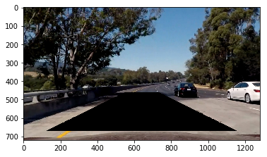

**Advanced Lane Finding Project**

The goals / steps of this project are the following:

* Compute the camera calibration matrix and distortion coefficients given a set of chessboard images.
* Apply a distortion correction to raw images.
* Use color transforms, gradients, etc., to create a thresholded binary image.
* Apply a perspective transform to rectify binary image ("birds-eye view").
* Detect lane pixels and fit to find the lane boundary.
* Determine the curvature of the lane and vehicle position with respect to center.
* Warp the detected lane boundaries back onto the original image.
* Output visual display of the lane boundaries and numerical estimation of lane curvature and vehicle position.

[//]: # (Image References)

[image1]: ./examples/calibration1.jpg "Distorted" width="48"
[image2]: ./examples/calibration1_Undist.jpg "Undistorted" width="48"
[image3]: ./examples/binary_combo_example.jpg "Binary Example"
[image4]: ./examples/warped_straight_lines.jpg "Warp Example"
[image5]: ./examples/color_fit_lines.jpg "Fit Visual"
[image6]: ./examples/example_output.jpg "Output"
[video1]: ./project_video.mp4 "Video"

***Camera Calibration***

The code for this step is contained in the second code cell of the IPython notebook "./example.ipynb".  

I start by preparing "object points", which will be the (x, y, z) coordinates of the chessboard corners in the world. Here I am assuming the chessboard is fixed on the (x, y) plane at z=0, such that the object points are the same for each calibration image.  The `    objpoints` will be appended with a copy of it every time I successfully detect all chessboard corners in a test image.  `imgpoints` will be appended with the (x, y) pixel position of each of the corners in the image plane with each successful chessboard detection.  

I then used the output `objpoints` and `imgpoints` to compute the camera calibration and distortion coefficients using the `cv2.calibrateCamera()` function.  I applied this distortion correction to the test image using the `cv2.undistort()` function and obtained this result: 


***Pipeline (single images)***

1. Distortion-correction

Using `mtx` and `dist` from the previous steps, the images are undistorted using `undistort`.


2. Creating a thresholded binary image

I used a combination of color and gradient thresholds to generate a binary image. Here's an example of my output for this step.


3. Performing a perspective transform

The code for my perspective transform includes a function called `birdseye(img)`, which takes as inputs an image (`img`) and based on the following source (`src`) and destination (`dst`) points, it performs the perspective transform.

```python
src = np.array([[585. /1280.*img_size[1], 455./720.*img_size[0]],
    [705. /1280.*img_size[1], 455./720.*img_size[0]],
    [1130./1280.*img_size[1], 720./720.*img_size[0]],
    [190. /1280.*img_size[1], 720./720.*img_size[0]]], np.float32)
    
dst = np.array([[300. /1280.*img_size[1], 100./720.*img_size[0]],
    [1000./1280.*img_size[1], 100./720.*img_size[0]],
    [1000./1280.*img_size[1], 720./720.*img_size[0]],
    [300. /1280.*img_size[1], 720./720.*img_size[0]]], np.float32)
```

This resulted in the following source and destination points:

| Source        | Destination   | 
|:-------------:|:-------------:| 
| 585, 455      | 300, 100        | 
| 705, 455      | 1000, 100      |
| 1130, 720     | 1000, 720      |
| 190, 720      | 300, 720        |




#### 4. Describe how (and identify where in your code) you identified lane-line pixels and fit their positions with a polynomial?

Then I did some other stuff and fit my lane lines with a 2nd order polynomial kinda like this:

![alt text][image5]

#### 5. Describe how (and identify where in your code) you calculated the radius of curvature of the lane and the position of the vehicle with respect to center.

I did this in lines # through # in my code in `my_other_file.py`

#### 6. Provide an example image of your result plotted back down onto the road such that the lane area is identified clearly.

I implemented this step in lines # through # in my code in `yet_another_file.py` in the function `map_lane()`.  Here is an example of my result on a test image:

![alt text][image6]

---

### Pipeline (video)

#### 1. Provide a link to your final video output.  Your pipeline should perform reasonably well on the entire project video (wobbly lines are ok but no catastrophic failures that would cause the car to drive off the road!).

Here's a [link to my video result](./project_video.mp4)

---

### Discussion

#### 1. Briefly discuss any problems / issues you faced in your implementation of this project.  Where will your pipeline likely fail?  What could you do to make it more robust?

Here I'll talk about the approach I took, what techniques I used, what worked and why, where the pipeline might fail and how I might improve it if I were going to pursue this project further.  
