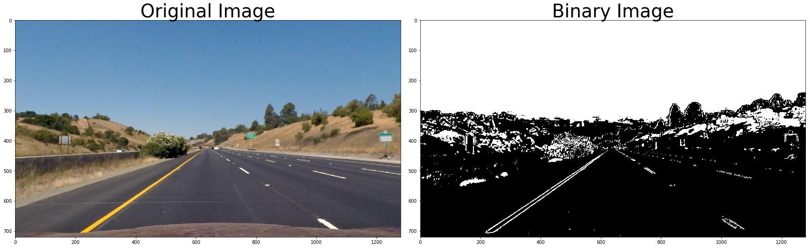

**Advanced Lane Finding Project**

The goals / steps of this project are the following:

* Compute the camera calibration matrix and distortion coefficients given a set of chessboard images.
* Apply a distortion correction to raw images.
* Use color transforms, gradients, etc., to create a thresholded binary image.
* Apply a perspective transform to rectify binary image ("birds-eye view").
* Detect lane pixels and fit to find the lane boundary.
* Determine the curvature of the lane and vehicle position with respect to center.
* Warp the detected lane boundaries back onto the original image.
* Output visual display of the lane boundaries and numerical estimation of lane curvature and vehicle position.

[//]: # (Image References)

[image1]: ./examples/calibration1.jpg "Distorted" width="48"
[image2]: ./examples/calibration1_Undist.jpg "Undistorted" width="48"
[image3]: ./examples/binary_combo_example.jpg "Binary Example"
[image4]: ./examples/warped_straight_lines.jpg "Warp Example"
[image5]: ./examples/color_fit_lines.jpg "Fit Visual"
[image6]: ./examples/example_output.jpg "Output"
[video1]: ./project_video.mp4 "Video"

***Camera Calibration***

The code for this step is contained in the second code cell of the IPython notebook "./example.ipynb".  

I start by preparing "object points", which will be the (x, y, z) coordinates of the chessboard corners in the world. Here I am assuming the chessboard is fixed on the (x, y) plane at z=0, such that the object points are the same for each calibration image.  The `    objpoints` will be appended with a copy of it every time I successfully detect all chessboard corners in a test image.  `imgpoints` will be appended with the (x, y) pixel position of each of the corners in the image plane with each successful chessboard detection.  

I then used the output `objpoints` and `imgpoints` to compute the camera calibration and distortion coefficients using the `cv2.calibrateCamera()` function.  I applied this distortion correction to the test image using the `cv2.undistort()` function and obtained this result: 


***Pipeline (single images)***

1. Distortion-correction

Using `mtx` and `dist` from the previous steps, the images are undistorted using `undistort`.


2. Creating a thresholded binary image

I used a combination of color and gradient thresholds to generate a binary image. Here's an example of my output for this step.



3. Performing a perspective transform

The code for my perspective transform includes a function called `birdseye(img)`, which takes as inputs an image (`img`) and based on the following source (`src`) and destination (`dst`) points, it performs the perspective transform.

```python
src = np.array([[585. /1280.*img_size[1], 455./720.*img_size[0]],
    [705. /1280.*img_size[1], 455./720.*img_size[0]],
    [1130./1280.*img_size[1], 720./720.*img_size[0]],
    [190. /1280.*img_size[1], 720./720.*img_size[0]]], np.float32)
    
dst = np.array([[300. /1280.*img_size[1], 100./720.*img_size[0]],
    [1000./1280.*img_size[1], 100./720.*img_size[0]],
    [1000./1280.*img_size[1], 720./720.*img_size[0]],
    [300. /1280.*img_size[1], 720./720.*img_size[0]]], np.float32)
```

This resulted in the following source and destination points:

| Source        | Destination   | 
|:-------------:|:-------------:| 
| 585, 455      | 300, 100        | 
| 705, 455      | 1000, 100      |
| 1130, 720     | 1000, 720      |
| 190, 720      | 300, 720        |


4. Identifing lane-line pixels and fiting their positions with a polynomial

The functions `lane_detection_init` and `lane_detection` are introduced for lane detection and fitting. The `lane_detection_init` is the full scale function for lane detection. It uses the histogram of the lower half of the image to find the approximate location of the lane. Then a rolling window based approach is used to find the lane throughout the image (10 subsections). Once all location of the lane is found for each subsection, the numpy's `polyfit` function is used to fit the lane.

The `lane_detection` function is the faster method that works based on the results of the previous images to find the location of the lane. A sanity check is introduced (`sanity` function) is ussed to check if the current lanes are very different from the previous findings. In that case, instead of `lane_detection`, `lane_detection_init` is used.


5. Identifying the radius of curvature of the lane and the position of the vehicle with respect to center

The radius of curvature is found based on the fitted polyline and the equation provided in the course. The vehicle's distance from the center is calculated based on the distance between the center of the lanes (founded in the image) and center of the image.

6. Wrapping the detected lane boundaries back onto the original image

The function `unwarped` is used to transfer the wrapped image into its original format based on `warpPerspective` function.

---

***Pipeline (video)***

Here's a [link to my video result](./advanced_lane_finding_working.mp4)

---

***Discussion***

The main issues is related to the thresholds used for lane detection. They are very site specific and a dynamic approach is necessary to ensure accurate result. 
